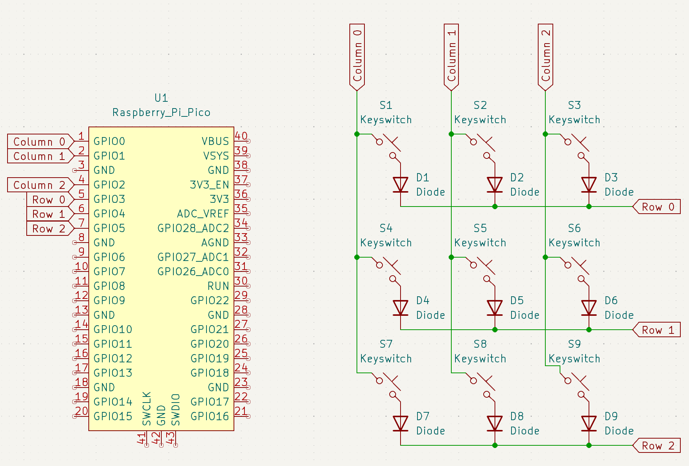
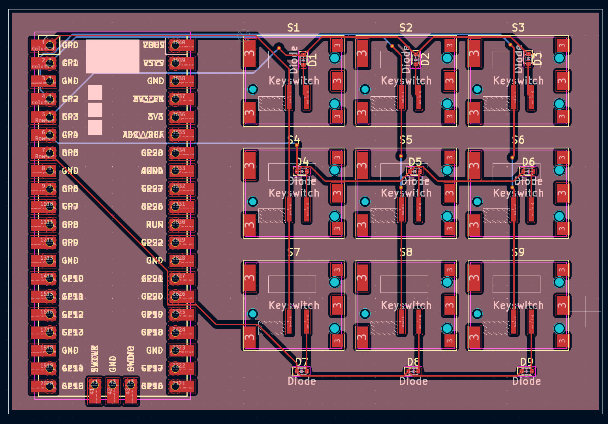
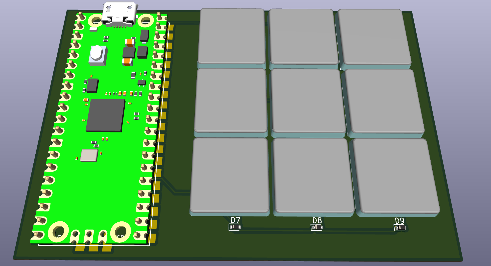

# RMK Heuristics

This project is an account of part of the effort I put into developing context to contribute the [RMK Project](rmk.rs)

**Folder Structure:**

- [`./docs/`](docs/) - a set of writing where I chart my understandings
- [`./programs/`](programs/) - a set programs I wrote to develop understanding
- [`./hardware/`](hardware/) - a [KiCAD](https://www.kicad.org/) project for the micro pad I created as example hardware

## Folder Overviews

### [`./docs/`](docs/)

Not enough content to write a blurb for this one

### [`./programs/`](programs/)

**TLDR:**

- 1 Programming Language
  - Rust
- 2 Boards
  - [RP Pico 1](https://www.raspberrypi.com/products/raspberry-pi-pico/)([RP2040](https://www.raspberrypi.com/products/rp2040/))
  - [nice!nano](https://nicekeyboards.com/nice-nano)([nRF52840](https://www.nordicsemi.com/Products/nRF52840))
- 3 Target Functions
  - Blinky LED
  - Switch testing
  - Micropad keyboard
- 4 Rust Projects
  - [`./programs/nrf52840_blinky/`](programs/nrf52840_blinky/) - Blinky LED on a nRF2040
  - [`./programs/rp2040_blinky/`](programs/rp2040_blinky/) - Blinky LED on a RP2040
  - [`./programs/rp2040_micropad/`](programs/rp2040_micropad) - Switch Tester, and Mircopad Keyboard on a RP2040
  - [`./programs/rp2040_rmk_micropad/`](programs/rp2040_rmk_micropad) - Mircopad Keyboard on a RP2040
- 9 Programs Written
  - [`./programs/nrf52840_blinky/src/bin/async_blinky.rs`](programs/nrf52840_blinky/src/bin/async_blinky.rs) - Async Blinky LED on a nRF52840
  - [`./programs/nrf52840_blinky/src/bin/sync_blinky.rs`](programs/nrf52840_blinky/src/bin/sync_blinky.rs) - Sync Blinky LED on a nRF52840
  - [`./programs/rp2040_blinky/src/bin/async_blinky.rs`](programs/rp2040_blinky/src/bin/async_blinky.rs) - Async Blinky LED on a RP2040
  - [`./programs/rp2040_blinky/src/bin/sync_blinky.rs`](programs/rp2040_blinky/src/bin/sync_blinky.rs) - Sync Blinky LED on a RP2040
  - [`./programs/rp2040_micropad/src/bin/matrix_tester_embassy.rs`](programs/rp2040_micropad/src/bin/matrix_tester_embassy.rs) - Switch tester
  - [`./programs/rp2040_micropad/src/bin/matrix_tester_rmk.rs`](programs/rp2040_micropad/src/bin/matrix_tester_rmk.rs) - Switch tester written with rmk
  - [`./programs/rp2040_micropad/src/bin/usb_embassy.rs`](programs/rp2040_micropad/src/bin/usb_embassy.rs) - Micropad Keyboard
  - [`./programs/rp2040_rmk_micropad/src/bin/manual.rs`](programs/rp2040_rmk_micropad/src/bin/manual.rs) - Micropad Keyboard made with RMK via manual implementation
  - [`./programs/rp2040_rmk_micropad/src/bin/toml.rs`](programs/rp2040_rmk_micropad/src/bin/toml.rs) - Micropad Keyboard made with RMK via config file implementation

### ['./hardware/'](hardware/)

**NOTICE:**

- I've provide no documentation for this part of the project. Interested parties are responsible for their own understanding
- Thank you to [NYC Resistor](https://www.nycresistor.com/) For helping to put together the board

**TLDR:**

|Schematic|PCB|3D Model|Real Device|
|---------|---|--------|-----------|
|||||
